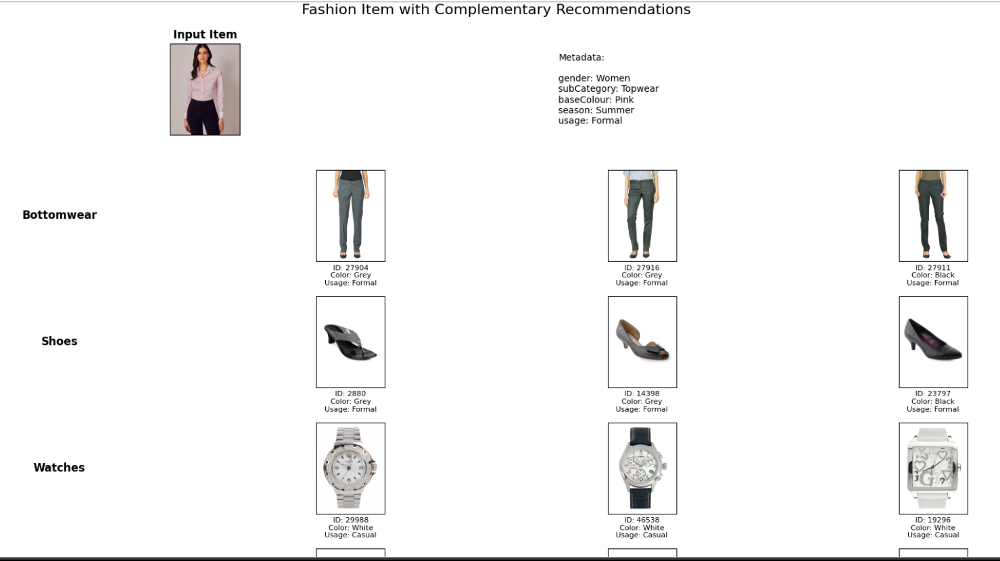
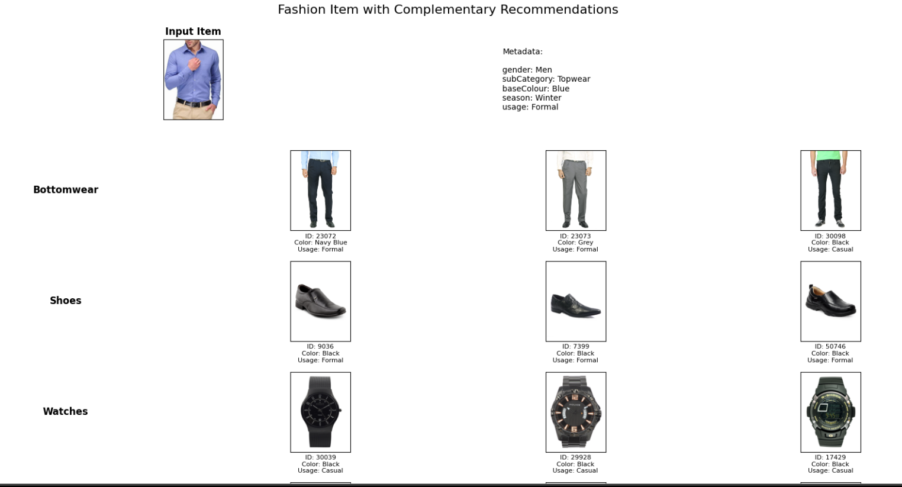

The first notebook v2 contains the primary eda and the preprocessing code along with the model architecture while the notebook named session contains the recommendation logic. The backend was quite big to deploy for free being a student i have fiancial restrictions so this project is not deployed like the other once but below are the results from testing the entire system.

